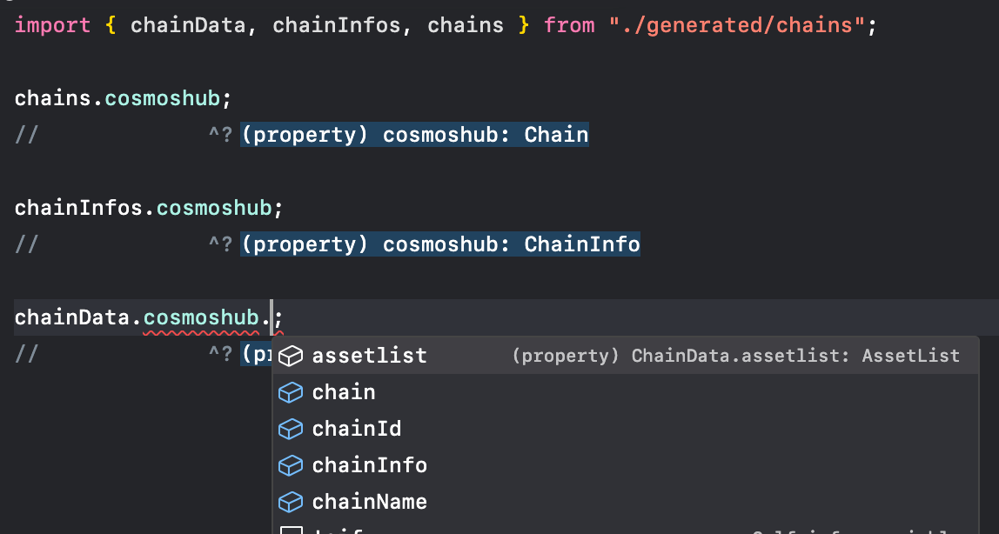

# API usage

## `chainData`

These exports aggregate all chain data into [Proxy](https://developer.mozilla.org/en-US/docs/Web/JavaScript/Reference/Global_Objects/Proxy) objects, which includes [chain registry data](https://github.com/graz-sh/types/blob/main/src/chain.ts), [chain info](https://github.com/graz-sh/types/blob/main/src/keplr/chain-info.ts), and [assetlist](https://github.com/graz-sh/types/blob/main/src/assetlist.ts). Objects are fully typed with chain id and chain paths.

## `chains` and `chainInfos`

Same as [`chainData`](#chaindata) but aggregates [chain registry data](https://github.com/graz-sh/types/blob/main/src/chain.ts) and [chain info](https://github.com/graz-sh/types/blob/main/src/keplr/chain-info.ts) respectively. Objects are fully typed with chain id and chain paths.

## `chainIds` and `chainNames`

These exports aggregate chain ids and chain names as array objects. Specific network types are also available as `mainnetChainIds`, `mainnetChainNames`, `testnetChainIds`, and `testnetChainNames`.

## `getChainData`

This export is a function that returns an object with [chain registry data](https://github.com/graz-sh/types/blob/main/src/chain.ts) as given parameters. e.g. given `["a", "b", "c"]` will return `{ a, b, c }`. Objects are fully typed same as [`chainData`](#chaindata).

## `getChainDataArray`

Same as `getChainData` but returns an array [chain registry data](https://github.com/graz-sh/types/blob/main/src/chain.ts) as given parameters. e.g. given `["a", "b", "c"]` will return `[a, b, c]`. Objects are fully typed same as [`chainData`](#chaindata).

