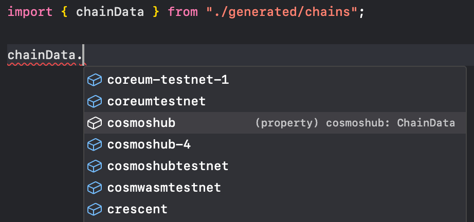
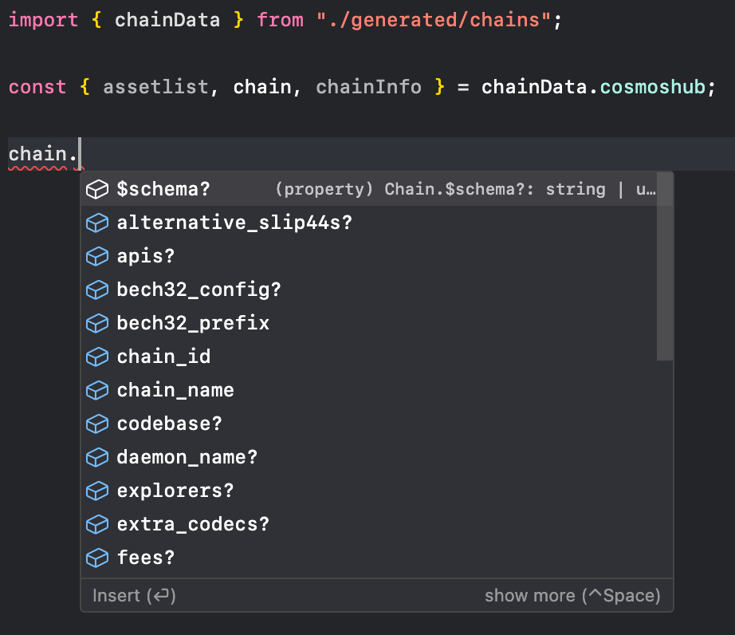
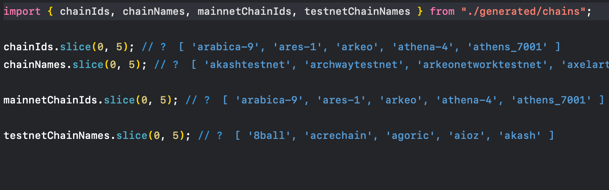
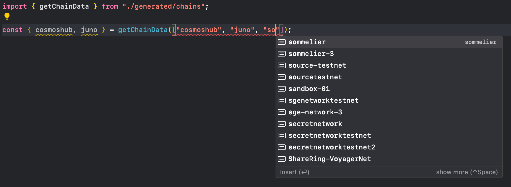
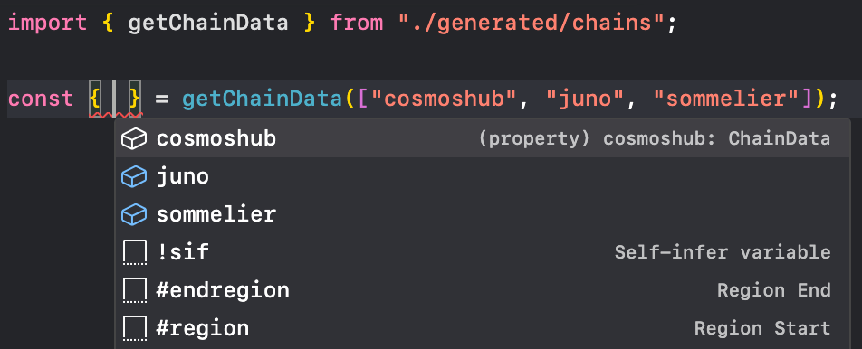

<!-- markdownlint-disable MD033 MD036 MD041 -->

# wadesta

[](https://www.npmjs.com/package/wadesta)
[](https://www.npmjs.com/package/wadesta)
[](https://github.com/graz-sh/wadesta)

Offline-first Cosmos chain registry JavaScript/TypeScript client generator 🪭

<!-- NPM_CLEAN_BELOW -->

<video src="https://assets.graz.sh/wadesta.mp4" autoplay loop muted></video>

- [How it works](#how-it-works)
- [Installing](#installing)
- [Generate usage](#generate-usage)
  - [Generate via CLI](#generate-via-cli)
  - [Generate programatically](#generate-programatically)
- [API usage](#api-usage)
  - [`chainData`](#chaindata)
  - [`chains` and `chainInfos`](#chains-and-chaininfos)
  - [`chainIds` and `chainNames`](#chainids-and-chainnames)
  - [`getChainData`](#getchaindata)
  - [`getChainDataArray`](#getchaindataarray)
- [Generator API usage](#generator-api-usage)
- [Roadmap](#roadmap)
- [Maintainers](#maintainers)
- [License](#license)

## How it works

Unlike other clients which fetches data remotely, `wadesta` fetches the registry's latest repository state once to generate the client locally using [`tiged`](https://github.com/tiged/tiged).

By knowing what chains exist beforehand, `wadesta` can generate strongly typed client which knows what chains are available.

## Installing

```sh
npm install wadesta     # install locally
npm -g install wadesta  # install globally
npx wadesta             # run without installing
```

## Generate usage

### Generate via CLI

```sh
# generate with default output to ./generated/chains/
wadesta generate

# generate using interactive mode
wadesta generate -i

# generate help command
wadesta generate --help

#   -r, --registry <source>    Chain registry source
#   -s, --registry-src <path>  Local chain registry path (if registry is `local`)
#   -o, --out-dir <path>       Generated client output directory
#   -m, --merged               Merge variables (e.g. only `chainIds` instead of `mainnetChainIds`, `testnetChainIds`, and `chainIds`)
#   -c, --clean                Clean output directory
#   -i, --interactive          Interactive mode
#   -h, --help                 Display this message
```

### Generate programatically

```ts
import { generate } from "wadesta";

// default arguments
generate({
  registry: "github:cosmos/chain-registry",
  outDir: "./generated/chains/",
});

// use local registry instead of cloning remotely
generate({
  registry: "local",
  registrySrc: "./path/to/registry/",
});

// unify variables instead of separate per network types
// e.g. false -> import { chainIds, mainnetChainIds, testnetChainIds } from "./generated/chains";
//      true  -> import { chainIds } from "./generated/chains";
generate({
  merged: true,
});
```

## API usage

### `chainData`

These exports aggregate all chain data into [Proxy](https://developer.mozilla.org/en-US/docs/Web/JavaScript/Reference/Global_Objects/Proxy) objects, which includes [chain registry data](https://github.com/graz-sh/types/blob/main/src/chain.ts), [chain info](https://github.com/graz-sh/types/blob/main/src/keplr/chain-info.ts), and [assetlist](https://github.com/graz-sh/types/blob/main/src/assetlist.ts). Objects are fully typed with chain id and chain paths.






### `chains` and `chainInfos`

Same as [`chainData`](#chaindata) but aggregates [chain registry data](https://github.com/graz-sh/types/blob/main/src/chain.ts) and [chain info](https://github.com/graz-sh/types/blob/main/src/keplr/chain-info.ts) respectively. Objects are fully typed with chain id and chain paths.


### `chainIds` and `chainNames`

These exports aggregate chain ids and chain names as array objects. Specific network types are also available as `mainnetChainIds`, `mainnetChainNames`, `testnetChainIds`, and `testnetChainNames`.



### `getChainData`

This export is a function that returns an object with [chain registry data](https://github.com/graz-sh/types/blob/main/src/chain.ts) as given parameters. e.g. given `["a", "b", "c"]` will return `{ a, b, c }`. Objects are fully typed same as [`chainData`](#chaindata).






### `getChainDataArray`

Same as `getChainData` but returns an array [chain registry data](https://github.com/graz-sh/types/blob/main/src/chain.ts) as given parameters. e.g. given `["a", "b", "c"]` will return `[a, b, c]`. Objects are fully typed same as [`chainData`](#chaindata).


## Generator API usage

```ts
import { generate, type GenerateArgs } from "wadesta";
```

```ts
interface GenerateArgs {
  clean?: boolean;
  registry?: (string & {}) | "local";
  registrySrc?: string;
  outDir?: string;
  merged?: boolean;
}

declare const generate: (args?: GenerateArgs) => Promise<void>;
```

## Roadmap

- [x] Generate chain registry client
- [ ] Generate IBC paths
- [ ] Filter generated chains
- [ ] Select module type (CommonJS, ESM)
- [ ] Select output extensions (`.js`, `.cjs`, `.mjs`, `.ts`)

## Maintainers

- Griko Nibras ([@grikomsn](https://github.com/grikomsn))
- Nur Fikri ([@codingki](https://github.com/codingki))
- Joshua Nathaniel M. ([@joshuanatanielnm](https://github.com/joshuanatanielnm))

## License

[MIT License, Copyright (c) 2023 Graz](./LICENSE)
